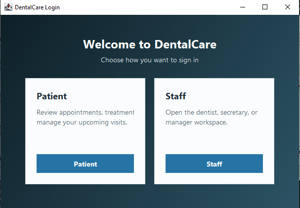
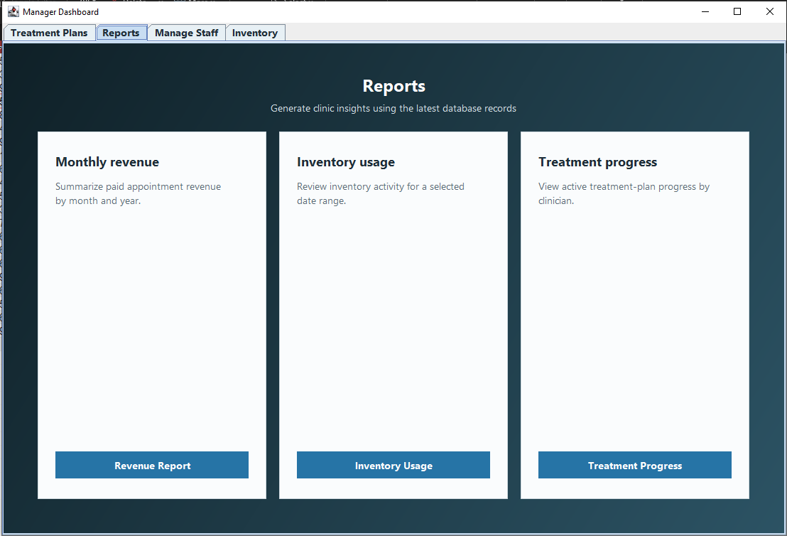
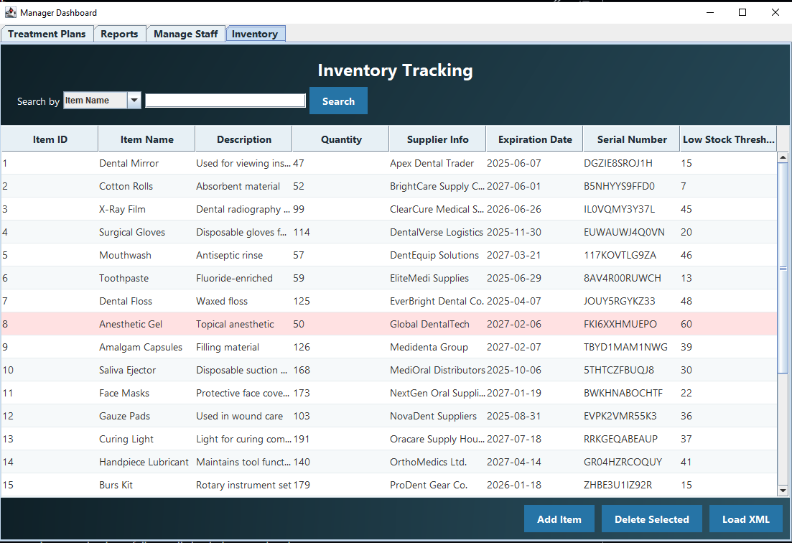
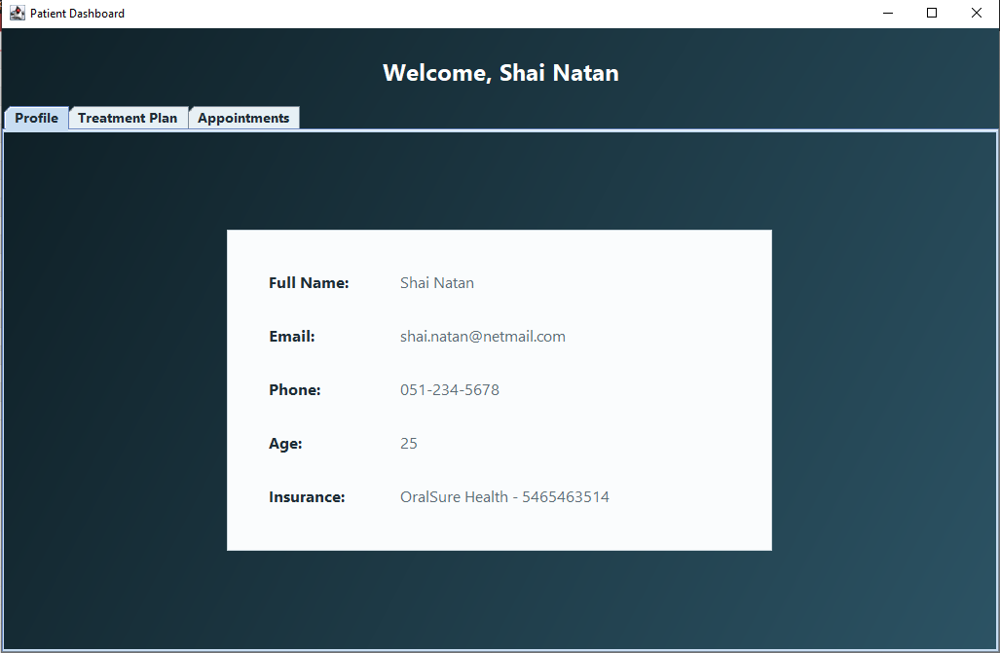
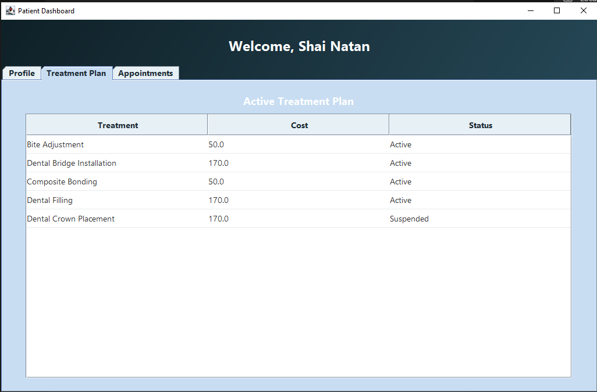
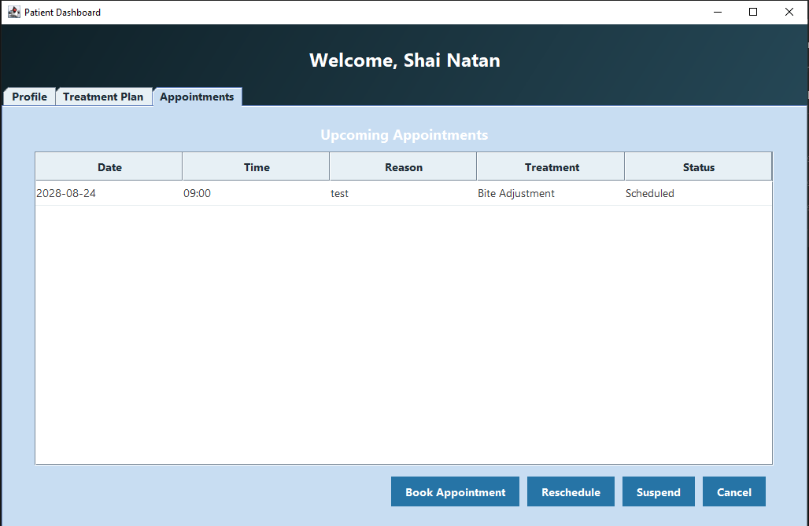
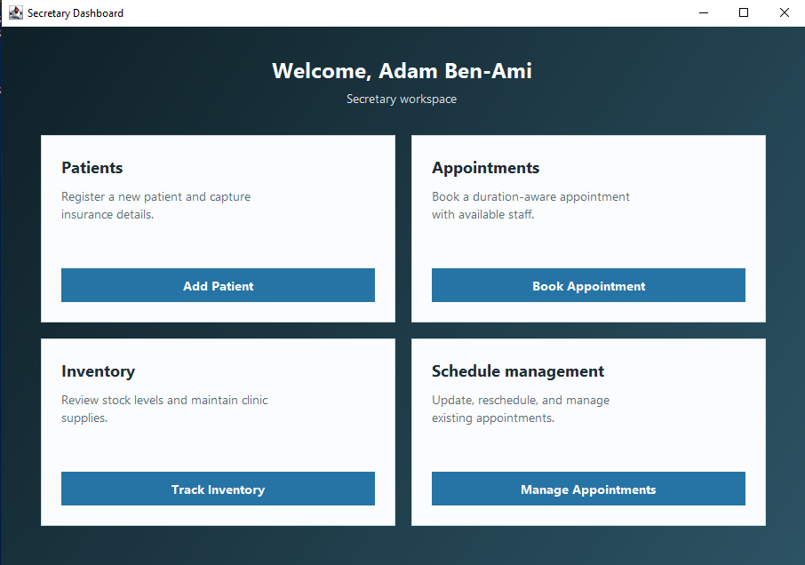
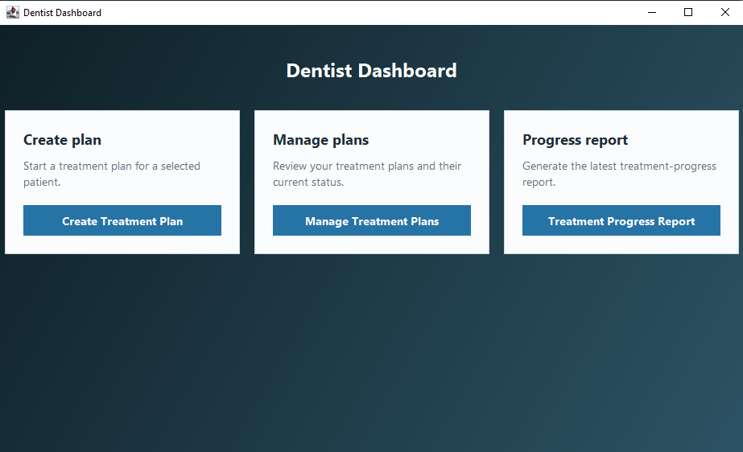

# DentalCare

[](https://github.com/youseftatour/DentalCare/actions/workflows/maven.yml)

DentalCare is a Java 17 Swing desktop application for managing appointments,
treatment plans, patients, staff, inventory, and clinic reports. It uses Maven
for repeatable builds and Microsoft Access through UCanAccess for persistence.
It is a student portfolio project, not a production clinical system.

## Features

### Patient

- Secure identifier-and-password login using BCrypt hashes
- View treatments and appointments
- Request appointments, reschedule them, or update appointment status

### Secretary

- Register patients and manage appointment booking
- Check staff availability using duration-aware overlap detection
- Record payment and sterilization status
- Manage inventory information

### Dentist

- View patients and assigned appointments
- Create and manage treatment plans
- Complete appointments and generate treatment-progress reports

### Manager

- Manage staff, treatment plans, and inventory
- Import supplier inventory from validated XML
- Generate revenue, inventory-usage, and treatment-progress reports

## Technologies

- Java 17 and Swing
- Maven
- Microsoft Access, JDBC, and UCanAccess
- JasperReports 7.0.1
- JCalendar
- BCrypt password hashing
- SLF4J logging
- JUnit 5

## Architecture

```text
Swing boundary classes
        ↓
Controllers
        ↓
Focused services
        ↓
Repositories / JDBC operations
        ↓
UCanAccess
        ↓
Microsoft Access
```

The migration toward this structure is incremental; some legacy SQL remains in
controllers and is documented as future work.

## Project Structure

```text
src/main/java/boundary    Swing screens and dialogs
src/main/java/control     Application coordination
src/main/java/service     Scheduling, validation, passwords, and reports
src/main/java/repository  Focused persistence operations
src/main/java/entity      Domain objects
src/main/java/utils       Database, XML, logging, and UI utilities
src/main/resources        JasperReports templates and compiled reports
src/test/java             Unit tests
```

## Screenshots

### Role selection



### Manager reports



### Manager inventory



### Patient dashboard

#### Profile



#### Treatment plan



#### Appointments



### Secretary dashboard



### Dentist dashboard



Screenshot assets and privacy guidance are documented in the
[`docs/screenshots` directory](docs/screenshots/README.md).

## Reports

JasperReports resources are packaged from `src/main/resources/boundary`.
Report filling is performed outside Swing classes, while dashboards display the
result asynchronously so database work does not block the event thread.

## XML Integration

The manager can preview and import supplier inventory XML. The parser blocks
DOCTYPE/external entities, validates required fields and values, detects duplicate
serial numbers, and reports imported/skipped counts. Database writes use one
transaction so a database failure rolls back the complete import.

## Running the Project

Requirements: JDK 17 and Maven 3.9+.

```bash
mvn clean package
java -jar target/dental-care-1.0.0-SNAPSHOT.jar
```

The application expects `DentalCare_Nimbus2000s.accdb` in the project working
directory. Existing database accounts must first receive a password hash as
described in [`docs/authentication-migration.md`](docs/authentication-migration.md).

## Testing

```bash
mvn test
```

Tests cover appointment intervals and time validation, domain validation,
password hashing, transaction cleanup, secure XML parsing, and missing report
resources. Access integration and Swing workflows still require manual testing.

## Building

```bash
mvn clean package
```

The Maven Shade plugin creates an executable JAR containing runtime dependencies.

## Future Improvements

- Finish moving remaining controller SQL into repositories
- Add isolated Access integration tests against a disposable database
- Add password-change and administrator account-provisioning screens
- Expand Swing background-task handling beyond report generation
- Replace the bundled demonstration database with a documented setup process

## Contributors

Developed and maintained by [youseftatour](https://github.com/youseftatour) as a
student portfolio project.
